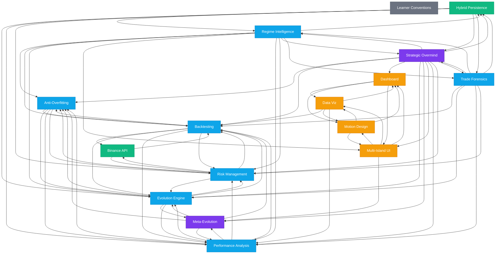

# Skill Dependency Graph

> Auto-generated by `scripts/generate-skill-map.js`
> Last updated: 2026-03-10T21:52:24.075Z

## How to Read This Graph

- **Purple nodes** (AI Layer): Strategic Overmind, Meta-Evolution
- **Blue nodes** (Engine Layer): Evolution Engine, Backtesting, Performance Analysis, etc.
- **Green nodes** (Data Layer): Hybrid Persistence, Binance Integration
- **Amber nodes** (UI Layer): Dashboard, Data Viz, Motion Design, Multi-Island UI
- **Gray nodes** (Foundation): Learner Conventions (connects to everything)

Arrows show dependency direction: if skill A → skill B, then code in A's domain depends on B's domain.

## Dependency DAG

## Skill Activation Rules

When editing a file, consult `.agent/skill-map.json` to determine:

| Priority | Meaning | Action |
|----------|---------|--------|
| **primary** | File IS a key file of this skill | Read SKILL.md **immediately** |
| **secondary** | File IMPORTS from this skill's domain | Review SKILL.md for relevant rules |
| **conventions** | Always applies | Follow `learner-conventions` rules |
