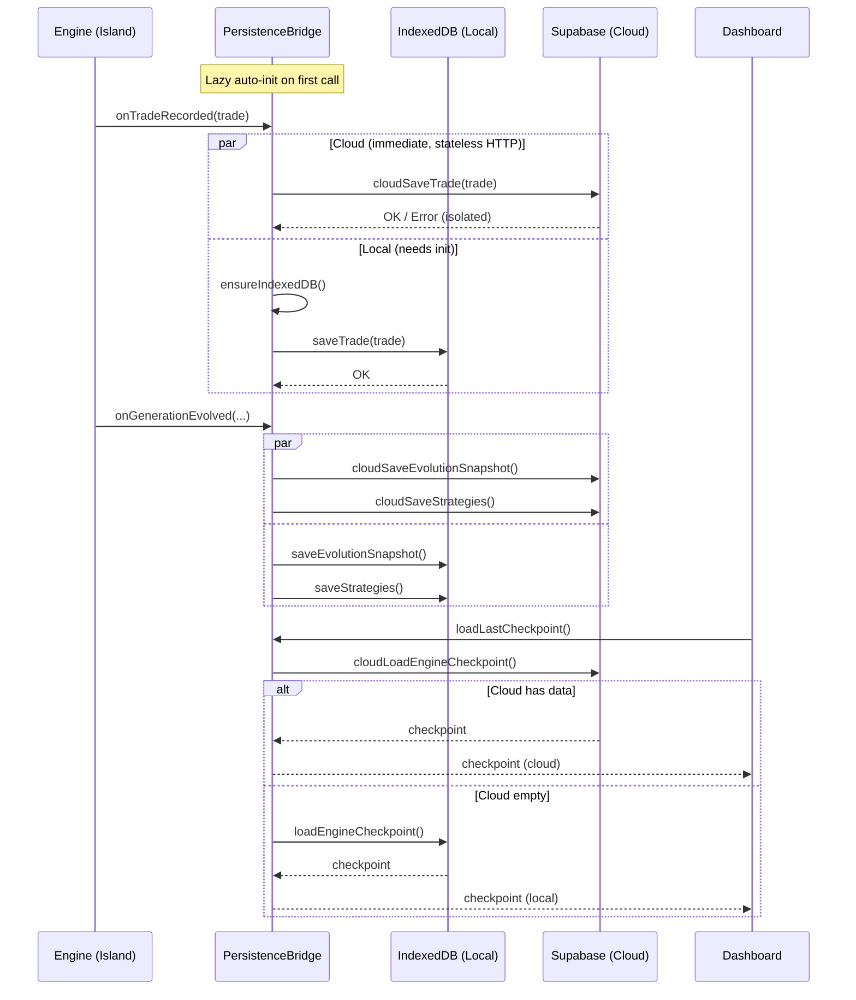
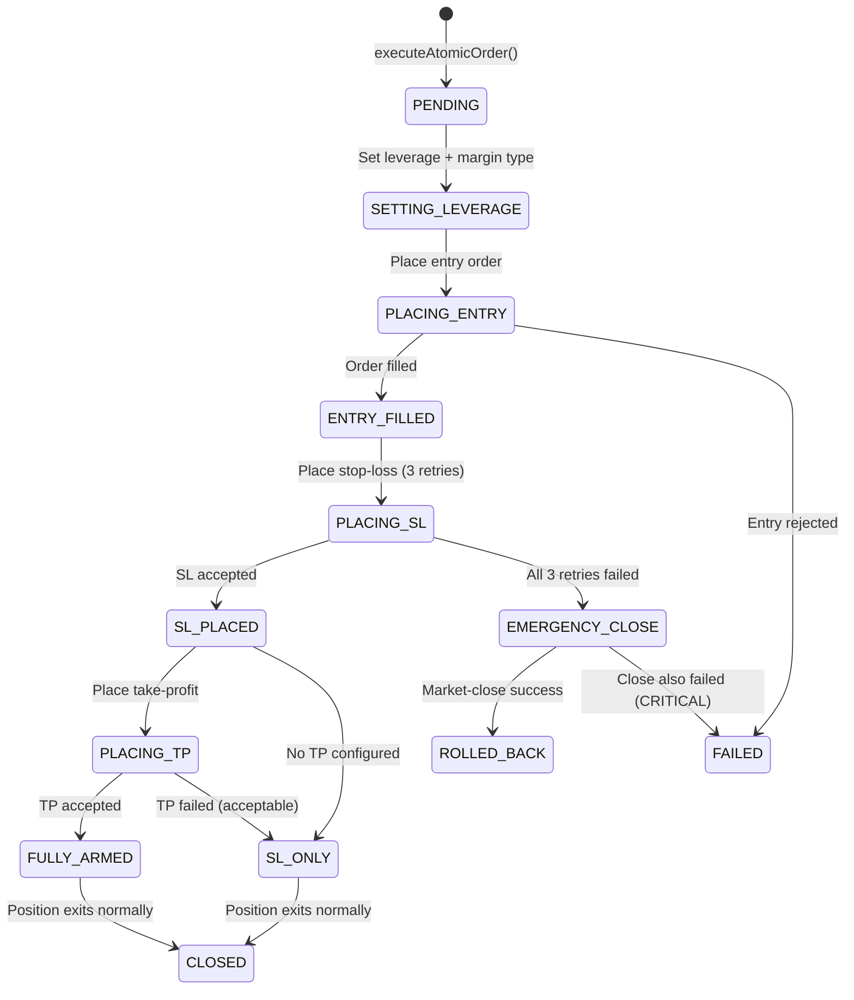
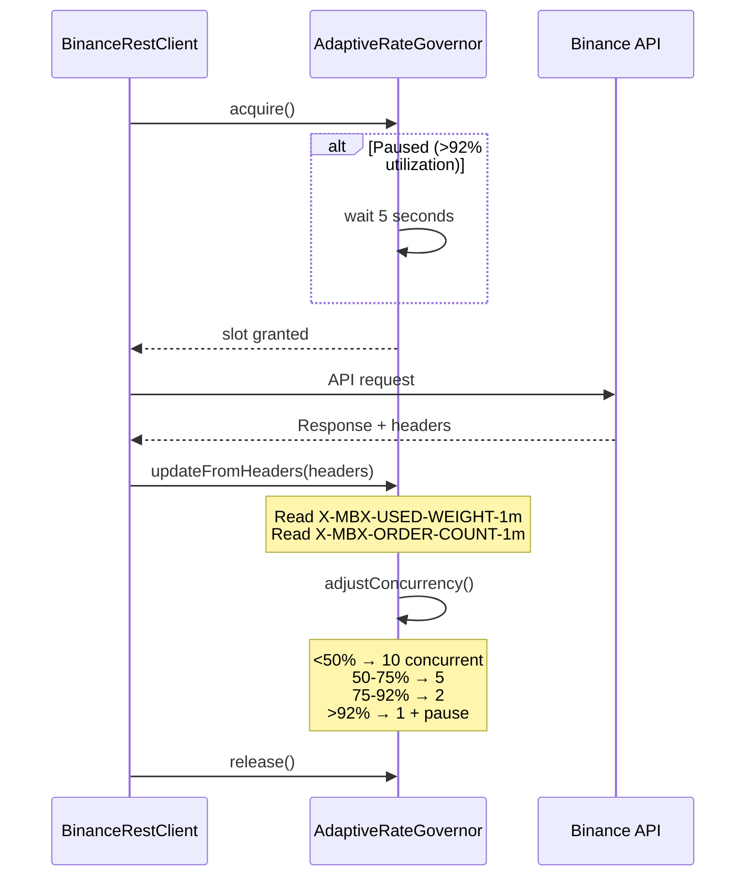

# System Design — Learner Architecture

## Module Dependency Graph

```mermaid
graph TD
    subgraph "Layer 1: Types"
        T[types/index.ts]
        TS[types/trading-slot.ts]
    end

    subgraph "Layer 2: Core Engine"
        DNA[strategy-dna.ts]
        EVAL[evaluator.ts]
        SIG[signal-engine.ts]
        EVO[evolution.ts]
        BRAIN[brain.ts]
        REPLAY[experience-replay.ts]
    end

    subgraph "Layer 2a: Advanced Genes"
        MICRO[microstructure-genes.ts]
        PA[price-action-genes.ts]
        COMP[composite-functions.ts]
        DC[directional-change.ts]
    end

    subgraph "Layer 2b: Anti-Overfitting"
        WFA[walk-forward.ts]
        MC[monte-carlo.ts]
        RD[regime-detector.ts]
        OFD[overfitting-detector.ts]
    end

    subgraph "Layer 2c: Island Model"
        ISLAND[island.ts]
        CORTEX[cortex.ts]
        META[meta-evolution.ts]
        MIG[migration.ts]
        CAP[capital-allocator.ts]
    end

    subgraph "Layer 2d: Binance Execution"
        BREST[api/binance-rest.ts]
        BWS[api/binance-ws.ts]
        CB[api/exchange-circuit-breaker.ts]
        UDS[api/user-data-stream.ts]
        ACCSYNC[api/account-sync.ts]
        AOLE[api/order-lifecycle.ts]
        EQT[api/execution-quality.ts]
    end

    subgraph "Layer 3: Safety"
        RISK[risk/manager.ts]
    end

    subgraph "Layer 4: State & Persistence"
        STORE[store/index.ts — 7 stores]
        PERSIST[store/persistence.ts]
        SUPABASE[db/supabase.ts]
        BRIDGE[persistence-bridge.ts]
        BOOT[system-bootstrap.ts]
    end

    subgraph "Layer 5: Presentation"
        PAGE[app/page.tsx]
        BRAIN_VIS[app/brain/page.tsx]
        PIPELINE[app/pipeline/page.tsx]
        IGNITION[IgnitionSequencePanel.tsx]
        CSS[app/globals.css]
        LAYOUT[app/layout.tsx]
    end

    T --> DNA
    T --> EVAL
    T --> EVO
    T --> BRAIN
    T --> RISK
    T --> STORE
    T --> PAGE
    T --> SIG
    TS --> ISLAND
    TS --> CORTEX
    TS --> MIG

    MICRO --> DNA
    PA --> DNA
    COMP --> DNA
    DC --> DNA
    MICRO --> SIG
    PA --> SIG
    COMP --> SIG
    DC --> SIG

    DNA --> EVO
    EVAL --> EVO
    EVAL --> BRAIN
    EVO --> BRAIN
    SIG --> BRAIN
    REPLAY --> BRAIN

    WFA --> BRAIN
    MC --> BRAIN
    RD --> BRAIN
    OFD --> BRAIN
    WFA --> ISLAND
    MC --> ISLAND
    RD --> ISLAND
    OFD --> ISLAND

    EVO --> ISLAND
    ISLAND --> CORTEX
    MIG --> CORTEX
    CAP --> CORTEX
    META --> CORTEX
    META --> ISLAND

    BRAIN --> STORE
    CORTEX --> STORE
    STORE --> PAGE
    CSS --> PAGE
    CSS --> PIPELINE
    STORE --> PIPELINE

    BRIDGE --> PERSIST
    BRIDGE --> SUPABASE
    ISLAND --> BRIDGE
    STORE --> PERSIST

    T --> BREST
    T --> AOLE
    T --> EQT
    BREST --> CB
    CB --> BREST
    BREST --> AOLE
    CB --> AOLE
    UDS --> ACCSYNC
    AOLE --> EQT
end
```

---

## Persistence Data Flow (Phase 14 — Hybrid Architecture)



### Key Design Decisions
- **Cloud writes fire first** — Supabase is stateless HTTP, no init needed
- **Local writes need lazy init** — IndexedDB requires `ensureIndexedDB()` on first call
- **Error isolation** — Cloud failure NEVER blocks local persistence (and vice versa)
- **Cloud-first reads** — `loadLastCheckpoint()` tries Supabase first, IndexedDB fallback
- **Singleton init promise** — Prevents race conditions on concurrent first writes

---

## Atomic Order Lifecycle Flow (Phase 19.1 — AOLE)



### Key Design Decisions
- **Core Invariant**: Position NEVER exists without stop-loss protection
- **SL retries (3×)** with exponential backoff (1s, 2s, 4s)
- **EMERGENCY_CLOSE**: Immediate market-close if SL exhausts all retries
- **TP failure is acceptable**: SL provides baseline protection
- **Partial fill handling**: SL/TP sized to `executedQty` (not `origQty`)
- **Execution Quality**: Every fill records slippage/latency for Tracker

---

## Adaptive Rate Governor (Phase 19.1)



### Data Types Persisted

| Data | Frequency | Cloud Table | IndexedDB Store |
|------|-----------|-------------|-----------------|
| Trades | On every close | `trades` | `trades` |
| Strategies | On generation evolved | `strategies` | `strategies` |
| Evolution Snapshots | On generation evolved | `evolution_snapshots` | `evolution_snapshots` |
| Forensic Reports | On trade close | `forensic_reports` | `forensic_reports` |
| Portfolio Snapshots | Every 60s (throttled) | `portfolio_snapshots` | `portfolio_snapshots` |
| Engine State | Every 30s (auto-checkpoint) | `engine_state` | `engine_state` |

---


## Data Flow

### 1. Island Model Architecture

```
Cortex (Orchestrator)
  ├── Island: BTCUSDT:1h
  │     ├── EvolutionEngine (pop: 10)
  │     ├── Validation Pipeline (4-Gate)
  │     ├── Trade History (scoped)
  │     └── Strategy Memory (regime-based)
  ├── Island: ETHUSDT:1h
  │     └── ... (same structure)
  ├── Island: BTCUSDT:15m
  │     └── ... (same structure)
  ├── Migration Engine (cross-island transfer)
  ├── Capital Allocator (weighted distribution)
  └── Correlation Guard (directional risk)
```

### 2. Strategy Evolution Pipeline (Per-Island)

```
Random Genesis → [Strategy DNA Pool] (tagged with slotId)
     │  (40% chance: advanced genes injected per family)
     │  ├─ Microstructure genes (volume profile, absorption)
     │  ├─ Price Action genes (parameterized patterns)
     │  ├─ Composite Function genes (math evolution)
     │  └─ Directional Change genes (event-based θ)
                        ↓
              Paper Trade Each Strategy (30+ trades)
                        ↓
              Collect Trade Results + Regime Tags
                        ↓
     Evaluate Performance (Complexity-Penalized + Novelty Bonus)
                        ↓
         ├─ Complexity Penalty (Occam's Razor)
         └─ Novelty Bonus (+8 max for advanced genes, decays over 200 gens)
                        ↓
     Tournament Selection → Crossover → Mutation (Adaptive Rate)
         ├─ Standard gene crossover/mutation
         └─ Advanced gene crossover/mutation/injection
                        ↓
              New Generation Created (Deflated Fitness Applied)
                        ↓
                   (Repeat Loop)
```

### 3. 4-Gate Validation Pipeline

```
Strategy reaches 30+ trades
         ↓
   Gate 1: Walk-Forward Analysis (efficiency ≥ 50%)
         ↓
   Gate 2: Monte Carlo Permutation (p-value < 0.05)
         ↓
   Gate 3: Overfitting Detection (score < 40/100)
         ↓
   Gate 4: Regime Diversity (≥ 2 unique regimes)
         ↓
   ALL PASS → CANDIDATE → ACTIVE
   ANY FAIL → RETIRED (with logged reason)
```

### 4. Cross-Island Migration

```
Island A (BTCUSDT:1h) — Top strategy fitness: 72
         ↓ Migration affinity check
         ↓ Same pair, different TF → 0.8 affinity
Island B (BTCUSDT:15m) — Receives adapted migrant
         ↓ Strategy re-scoped: fitness reset, slotId updated
         ↓ Must prove itself from scratch in new environment
```

### 5. Capital Allocation

```
Total Capital: $10,000
         ↓ 3-factor weighting
  ┌─ Lifetime Fitness (60%)
  ├─ Recent Trend (30%)
  └─ Diversity Contribution (10%)
         ↓
  Island A: 25% ($2,500)
  Island B: 22% ($2,200)
  Island C: 18% ($1,800)  ← floor: min 5%
  ...                      ← cap: max 30%
```

### 6. Trade Execution Flow (Future)

```
Cortex receives market data → updates all pair-matching islands
         ↓
Island selects Active Strategy
         ↓
Strategy DNA → Signal Rules evaluated against Market Data
         ↓
Entry Signal Triggered → Risk Manager validates trade (GLOBAL)
         ↓
         ┌── PASS → Execute Order → Track Position → Monitor Exit Signals
         └── FAIL → Log rejection → Skip trade
```

### 7. Dashboard Data Flow

```
SystemBootstrap → useBootStore → IgnitionSequencePanel
Cortex → CortexSnapshot → useCortexStore → Multi-island dashboard (future)
AIBrain → BrainSnapshot  → useBrainStore  → Current 10-panel dashboard
                                              ├── IgnitionSequencePanel
                                              ├── PortfolioOverview
                                              ├── ActiveStrategyPanel
                                              ├── RiskGauge
                                              ├── PerformanceChartPanel
                                              ├── EvolutionTimelinePanel
                                              ├── BrainMonitorPanel
                                              ├── CortexNeuralMapPanel
                                              ├── TradeHistoryPanel
                                              └── MarketOverviewPanel
```

### 8. Pipeline Dashboard Data Flow (`/pipeline`)

```
Demo Data Generators / Future: Cortex State
         ↓
PipelineStateMachine (auto-cycling demo engine)
         ↓
7-Stage Pipeline Flow → per-stage stats (pop, trades, fitness, gates, roster)
         ↓
├── GenerationFitnessPanel ← GenerationData[]
├── ValidationGatePanel ← GateResult[] (animated reveal)
├── StrategyRosterPanel ← RosterEntry[] → RadarChart + List
├── ExperienceReplayPanel ← ReplayCell[] → Regime×Pattern heatmap
├── GeneLineagePanel ← LineageNode[] → Family tree by generation
├── GeneSurvivalPanel ← SurvivalRow[] → Gene×Generation persistence grid
└── DecisionExplainerPanel ← DecisionEvent[] → Regime change reasoning
```

### 9. Strategy Archaeology Data Flow

```
Evolution Engine tracks gene persistence across generations
         ↓
Gene Lineage: strategy origin (random/seeded/crossover/mutation)
         ↓
Gene Survival: which gene configs survive across generations
         ↓
              ┌── persistenceScore ≥ 60% → 🔥 Proven Gene (persistent glow)
              └── persistenceScore < 60% → normal cell
         ↓
Decision Explainer: regime change triggers
         ↓
  ┌── Bayesian confidence score of each Roster strategy
  ├── Past performance in target regime
  ├── Gene provenance (proven genes from Survival Heatmap)
  └── Rejected alternatives with rejection reasons
         ↓
  Explainable decision: "AI chose X because..."
```

### 8. Meta-Evolution (GA²) Data Flow

```
Cortex tracks total strategy generations
         ↓ Every 10 generations...
Meta-Evolution Cycle Triggered
         ↓
  For each Island: collect meta-fitness inputs
    ├─ Convergence Speed: best fitness / generation number
    ├─ Peak Fitness: highest fitness achieved
    ├─ Fitness Stability: inverse of last 5 generation variance
    └─ Validation Pass Rate: strategies passed / total validated
         ↓
  MetaEvolutionEngine evaluates all HyperDNA
         ↓
  Sort Islands by meta-fitness score
         ↓
  Meta-Crossover: weighted average of top 2 HyperDNA
         ↓
  Conservative Meta-Mutation: ±10% max perturbation
         ↓
  Stability Guard: clamp to safe ranges
         ↓
  Replace worst Island's HyperDNA with offspring
         ↓
  Island reconfigures its EvolutionEngine with new parameters
```

---

## Zustand Store Architecture

| Store | Data Domain | Persistence |
|-------|-------------|-------------|
| `useBrainStore` | AI Brain state, strategy, evolution, logs, validation | In-memory only |
| `useCortexStore` | Multi-island orchestration, island snapshots, migration, capital | In-memory only |
| `usePortfolioStore` | Balance, P&L, positions | In-memory only |
| `useTradeStore` | Trade history (last 500) | LocalStorage |
| `useMarketStore` | Live tickers, selected pair | In-memory only |
| `useDashboardConfigStore` | UI preferences, testnet toggle | LocalStorage |

---

## Risk Management Integration

The Risk Manager operates as an **independent, GLOBAL safety layer** across ALL islands:

```
Any Island → "I want to open BTCUSDT LONG"
    ↓
Risk Manager checks (GLOBALLY):
  1. Position size ≤ 2% of GLOBAL balance?
  2. Current positions < 3 (ALL ISLANDS COMBINED)?
  3. Daily drawdown < 5% (SUM of all island PnLs)?
  4. Total drawdown < 15%?
  5. Stop-loss present?
  6. Leverage ≤ 10x?
  7. Emergency stop NOT active?
    ↓
  ┌── ALL PASS → Trade executed
  └── ANY FAIL → Trade rejected, reason logged
```

---

## Key Design Patterns

| Pattern | Where Used | Why |
|---------|-----------|-----|
| **Genome/DNA** | `strategy-dna.ts` | Enables sexual reproduction (crossover) and mutation of strategies |
| **Tournament Selection** | `evolution.ts` | Balances exploration/exploitation better than roulette wheel |
| **Composite Fitness** | `evaluator.ts` | Multi-metric scoring with complexity penalty prevents overfitting |
| **Snapshot Pattern** | `brain.ts`, `island.ts`, `cortex.ts` | Immutable state snapshots for thread-safe dashboard updates |
| **Persist Middleware** | `store/index.ts` | Selective localStorage persistence for trades and config only |
| **Island Model GA** | `island.ts`, `cortex.ts` | Isolated evolution per pair+timeframe prevents cross-contamination |
| **Meta-Evolution (GA²)** | `meta-evolution.ts`, `island.ts`, `cortex.ts` | Second-layer GA optimizes evolution parameters (HyperDNA) per-island |
| **Migration** | `migration.ts` | Cross-island knowledge transfer with affinity-based topology |
| **Deflated Sharpe** | `monte-carlo.ts` | Corrects for multiple-testing bias across generations |
| **Walk-Forward** | `walk-forward.ts` | Validates out-of-sample performance to prevent curve fitting |
| **Regime Memory** | `evolution.ts` | Tracks which gene configs excel per market regime |
| **Advanced Gene Injection** | `strategy-dna.ts` | 40% per-family injection rate in random genesis → structural innovation |
| **Composite Function Evolution** | `composite-functions.ts` | 9 mathematical operations × 4 normalizations → AI discovers indicator combinations |
| **Directional Change Framework** | `directional-change.ts` | Event-based price segmentation with evolved θ threshold (Kampouridis) |
| **Structural Novelty Bonus** | `evaluator.ts` | Fitness bonus for advanced gene usage, decaying over generations |
| **Advanced Pattern Replay** | `experience-replay.ts` | MICROSTRUCTURE_COMBO + COMPOSITE_FUNCTION patterns stored for seeding |
| **Gradient Accents** | `globals.css` | Visual differentiation of card types through colored top-borders |
| **Stagger Animation** | `globals.css`, `page.tsx` | Cinematic card entrance with sequential delays |
| **Pipeline State Machine** | `pipeline/page.tsx` | Auto-cycling demo engine that simulates real-time pipeline progression |
| **Gene Persistence Tracking** | `pipeline/page.tsx` | Tracking which gene configs survive across generations → proven patterns |
| **Explainable AI** | `pipeline/page.tsx` | Decision reasoning chains showing WHY AI chose each strategy |

---

### 10. Advanced Gene Signal Flow (Phase 9)

```
Strategy DNA received for evaluation
         ↓
Signal Engine: calculateAdvancedSignals(dna, candles)
         ↓
  ├── Microstructure Genes (if present)
  │     ├─ Volume Profile → POC detection, bucket analysis
  │     ├─ Volume Acceleration → spike/accumulation signals
  │     ├─ Candle Anatomy → body:wick ratio analysis
  │     ├─ Range Dynamics → expansion/contraction detection
  │     └─ Absorption → whale activity detection
  ├── Price Action Genes (if present)
  │     ├─ Candlestick Patterns → 10 formations with evolved thresholds
  │     ├─ Structural Breaks → N-bar high/low
  │     ├─ Swing Sequences → HH/HL, LH/LL
  │     ├─ Compression → narrowing range → breakout
  │     └─ Gap Analysis → ATR-normalized gaps
  ├── Composite Function Genes (if present)
  │     └─ f(indicator_A, indicator_B) → 9 ops × 4 norms → novel signal
  └── Directional Change Genes (if present)
        ├─ DC Event Detection (θ% reversal threshold)
        ├─ DC Indicators (trendRatio, oscillation, magnitude)
        └─ Overshoot analysis
         ↓
Aggregate: bullishSignals vs bearishSignals
         ↓
  ├─ aggregateBias: 'bullish' | 'bearish' | 'neutral'
  └─ advancedConfidence: 0-1 (agreement ratio)
         ↓
Fed to entry/exit decision alongside standard indicator signals
```

---

### 11. System Bootstrap Flow (Phase 36)

```
User clicks IGNITE SYSTEM button
         ↓
useBootStore.ignite() → SystemBootstrap.boot()
         ↓
   Phase 1: ENV_CHECK
         ├── Validate env vars (Binance, Supabase)
         ├── setTimeout(0) → yield to event loop
         └── 400ms minimum display
         ↓
   Phase 2: PERSISTENCE
         ├── Initialize IndexedDB + Supabase
         ├── Load latest checkpoint
         └── 400ms minimum display
         ↓
   Phase 3: CORTEX_SPAWN
         ├── Initialize Cortex engine
         ├── Create islands from trading slots
         └── Wire RiskManager
         ↓
   Phase 4: HISTORICAL_SEED
         ├── Fetch 500 candles per slot
         ├── Seed islands with data
         └── Calibrate MRTI
         ↓
   Phase 5: WS_CONNECT
         ├── Kline WebSocket connections
         ├── Ticker streams
         └── User data stream
         ↓
   Phase 6: EVOLUTION_START
         ├── Begin autonomous evolution
         ├── Wire scheduler
         └── Enable paper trading
         ↓
   Phase 7: READY
         ├── System fully operational
         ├── Start auto-checkpoint (5m interval)
         └── Record boot history entry
         ↓
   IgnitionSequencePanel: Waterfall chart + result badges + history
```

---

*Last Updated: 2026-03-10 17:00 (UTC+3)*
